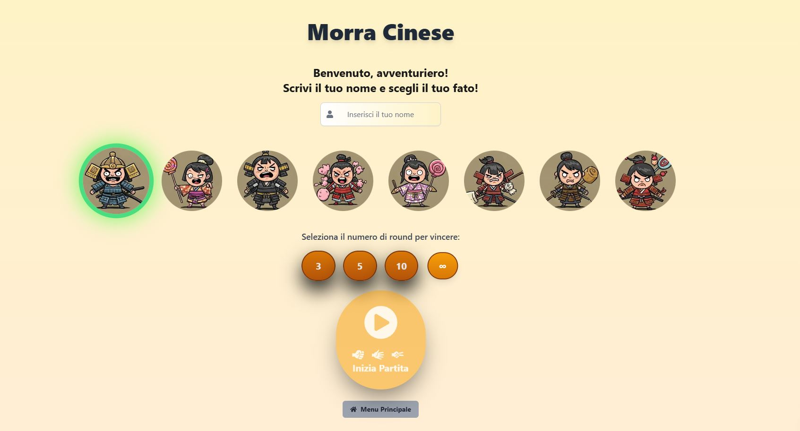

[](https://app.netlify.com/sites/morra-cinese-davide017017/deploys)
[](https://opensource.org/licenses/MIT)
[](https://nextjs.org/)
[](https://reactjs.org/)
[](https://tailwindcss.com/)

# Morra Cinese (Carta, Pietra, Forbici)

**Un divertente gioco di Morra Cinese (Carta, Pietra, Forbici) sviluppato con Next.js e Tailwind CSS.**

**Demo Online:** [Link alla tua applicazione online](https://morra-cinese-davide017017.netlify.app/)



## ✨ Descrizione

Questa applicazione web permette di giocare a Morra Cinese contro il computer. L'interfaccia è intuitiva e offre un'esperienza di gioco coinvolgente, sfruttando le moderne tecnologie del web per garantire prestazioni e un design accattivante.

## 💻 Tecnologie utilizzate

* **[Next.js](https://nextjs.org/):** Framework React per il rendering lato server (SSR) e la generazione di siti statici (SSG), ottimizzando le prestazioni e la SEO.
* **[React](https://reactjs.org/):** Libreria JavaScript per la creazione di interfacce utente dinamiche e interattive.
* **[Tailwind CSS](https://tailwindcss.com/):** Framework CSS utility-first per uno sviluppo rapido e personalizzabile, senza la necessità di scrivere CSS personalizzato.
* **Font personalizzati:** Utilizzo di font Geist per un'estetica moderna e distintiva.
* **Responsive Design:** L'applicazione è progettata per adattarsi a diverse dimensioni di schermo, offrendo un'esperienza utente ottimale su desktop, tablet e dispositivi mobili.
* **SEO di base:** Implementazione di meta tag e ottimizzazioni di base per migliorare la visibilità sui motori di ricerca.
* **Progressive Web App (PWA):** Supporto per PWA con file manifest per un'esperienza utente simile a un'app nativa.

## 🕹️ Funzionalità

* Gioca contro il computer con un'intelligenza artificiale di base.
* Interfaccia utente intuitiva e facile da usare.
* Design responsive che si adatta a diverse dimensioni di schermo.
* Statistiche di gioco in tempo reale: visualizza le tue vittorie, pareggi e sconfitte.
* Selezione del numero di round necessari per vincere la partita.
* Possibilità di scegliere un'icona utente personalizzata.
* Supporto per Progressive Web App (PWA), installabile come un'app nativa.

## 🛠️ Installazione

1. **Clona il repository:**

   ```bash
   git clone [https://github.com/tuo-username/morra-cinese.git](https://github.com/tuo-username/morra-cinese.git)

**Realizzato con ❤️ e codice da davide017017**